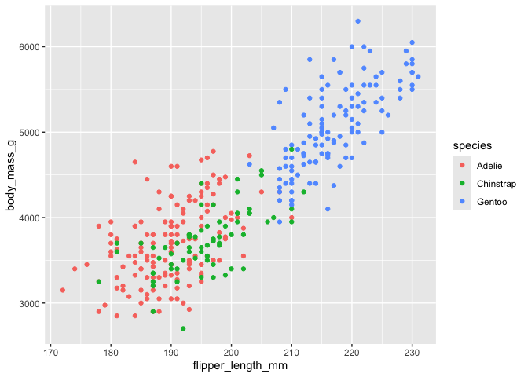

# My quarto part 2
Ally Malilay

<script src="Week06_OnlineLecture_files/libs/kePrint-0.0.1/kePrint.js"></script>
<link href="Week06_OnlineLecture_files/libs/lightable-0.0.1/lightable.css" rel="stylesheet" />

# Introduction

Today, we are learning about how to work with figures.

# Load the libraries

``` r
library(here)
library(tidyverse)
library(palmerpenguins)
library(kableExtra)
```

# Make a plot

``` r
penguins %>%
  ggplot(aes(x = flipper_length_mm, y = body_mass_g, color = species)) +
  geom_point()
```

<div id="fig-penguin">



Figure 1: This is a figure showing the flipper length by body mass

</div>

When you look at
<a href="#fig-penguin" class="quarto-xref">Figure 1</a>, we can see
there is a positive relationship between flipper length and body mass.

| Time   | Session  |   Topic |
|:-------|:--------:|--------:|
| *left* | *center* | *right* |
| 01:00  |    1     | Anatomy |
| 01:50  |          | *Break* |
| 02:00  |    2     |  Tables |
| 02:45  |          | *Break* |

``` r
penguins %>%
  group_by(species) %>%
  summarise(flipperlengthmean = mean(flipper_length_mm, na.rm = TRUE)) %>%
  kbl() %>% #add kable table
kable_classic() %>% #add theme
row_spec(2, bold = TRUE, color = "black", background = "pink") %>% #edit appearance of row 2
kable_styling(full_width = FALSE)
```

<div id="tbl-penguin">

Table 1: My awesome penguin table

<div class="cell-output-display">

| species   | flipperlengthmean |
|:----------|------------------:|
| Adelie    |          189.9536 |
| Chinstrap |          195.8235 |
| Gentoo    |          217.1870 |

</div>

</div>

<a href="#tbl-penguin" class="quarto-xref">Table 1</a> contains
information on the average flipper length of the three penguin species.
