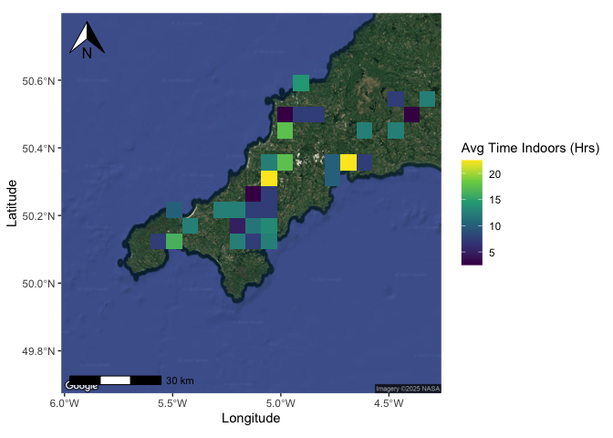

# Week 7 Assignment 🐈
Ally Malilay
2025-10-13

- [Introduction](#introduction)
  - [Load libraries and data](#load-libraries-and-data)
  - [Clean the data](#clean-the-data)
  - [Determine map location](#determine-map-location)
  - [Our Map!](#our-map)
  - [Summary](#summary)

# Introduction

Let’s take a closer look at the [Pet Cats UK
Data](https://github.com/rfordatascience/tidytuesday/blob/main/data/2023/2023-01-31/readme.md)
from *The small home ranges and large local ecological impacts of pet
cats*! We’re going to explore the average amount of time that the cats
from this dataset spend indoors.


## Load libraries and data

``` r
library(tidyverse)
library(here)
library(dplyr)
library(maps)
library(mapdata)
library(mapproj)
library(ggmap)
library(ggspatial)
library(ggplot2)

## Load data ######
tuesdata <- tidytuesdayR::tt_load('2023-01-31')
cats_uk <- tuesdata$cats_uk
cats_uk_reference <- tuesdata$cats_uk_reference
```

## Clean the data

We want to use summary statistics to get the average location where each
cat was tracked. We’ll also calculate the average amount of time each
cat spent indoors.

``` r
cats_joined <- cats_uk %>%
  left_join(cats_uk_reference, by = "tag_id") %>% #join the two datasets for hours indoors data
  group_by(tag_id) %>% #group all tag_id together
  summarise(mean_lon = mean(location_long, na.rm = TRUE), #average longitude of individual cat
    mean_lat = mean(location_lat, na.rm = TRUE), #average latitutde of individual cat
    mean_hrs_indoors = mean(hrs_indoors, na.rm = TRUE)) #average time spent indoors of each cat
```

## Determine map location

I took a look on Google maps and the latitude and longitudes from this
dataset for the most ideal placement of this map.

``` r
ukmapzoom <- data.frame(lon = -5.137756, lat = 50.240867)
Map1 <- get_map(ukmapzoom, zoom = 9, #3 is continent level, 20 is singular building
                maptype = "satellite") #change map type 
```

## Our Map!

``` r
ggmap(Map1) +
  stat_summary_2d(data = cats_joined,
             aes(x = mean_lon, #add longitude
                 y = mean_lat, #add latitude
                 z = mean_hrs_indoors), #add mean indoors
             bins = 25) +
  annotation_scale(bar_cols = c("black", "white"), location = "bl") + #scale bar bottom left
  annotation_north_arrow(location = "tl", #north arrow to top left
                         height = unit(1, "cm"), #shrink size of north arrow
                         width = unit(1, "cm")) + #shrink size of north arrow
  coord_sf(crs = 4326) + #coordinates
  labs(x = "Longitude", #x-axis label
    y = "Latitude") + #y-axis label
  scale_fill_viridis_c(name = "Avg Time Indoors (Hrs)") 

ggsave(here("Week_07","Output","CatsAvgTimeIndoors.pdf"))
```

<div id="fig-catsindoors">



Figure 1: This is a figure showing the average amount of time that cats
from this 2017 survey spent indoors

</div>

## Summary

<a href="#fig-catsindoors" class="quarto-xref">Figure 1</a> displays the
average amount of time that cats from *The small home ranges and large
local ecological impacts of pet cats* spent indoors. You can find the
article
[here](https://zslpublications.onlinelibrary.wiley.com/doi/10.1111/acv.12563)
along with the [Movebank data
package](https://datarepository.movebank.org/entities/datapackage/4ef43458-a0c0-4ff0-aed4-64b07cedf11c).
